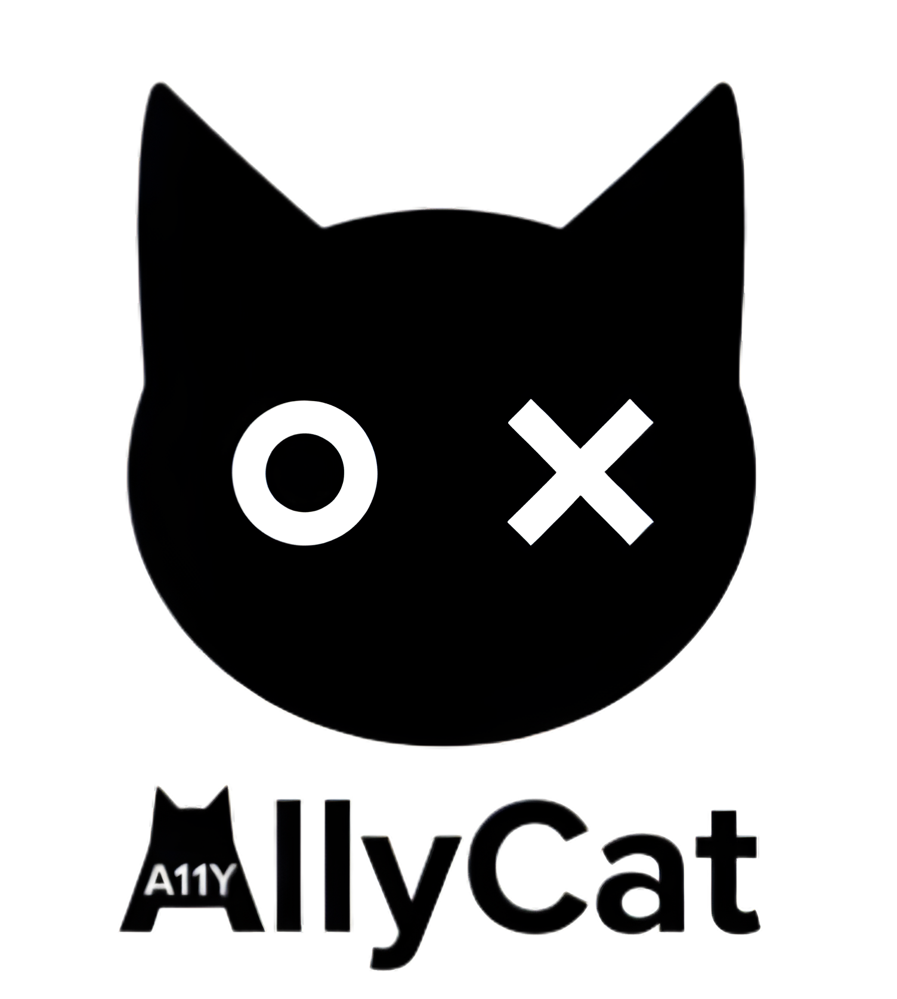
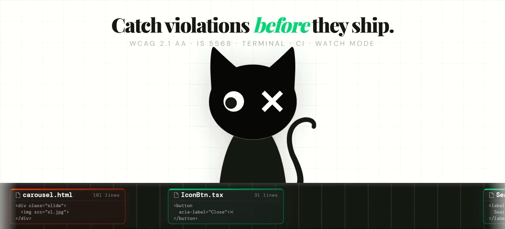

<p align="center">
  
</p>

# AllyCat

[](https://github.com/AllyCatHQ/allycat-core/actions/workflows/ci.yml)
[](https://www.npmjs.com/package/allycat)
[](https://nodejs.org)
[](https://opensource.org/licenses/MIT)
[](https://www.npmjs.com/package/allycat)

> **The accessibility tool that works the way developers work** — scan source files directly, get exact line numbers, watch mode, CI gates, and AI-ready fix prompts in one.

**Supports**: JSX/TSX, Vue, Angular, HTML • Israeli IS 5568 + RTL • Quick (JSDOM) & Full (Playwright) modes

<p align="center">
  
</p>

---

## Table of Contents

- [Features](#features)
- [Why AllyCat vs @axe-core/cli](#why-allycat-vs-axe-corecli)
- [Quick Start](#quick-start)
- [Installation](#installation)
- [Commands](#commands)
- [Configuration](#configuration)
- [Supported File Types](#supported-file-types)
- [Parallel Scanning & Performance](#parallel-scanning--performance)
- [Accessibility Standards](#accessibility-standards)
- [Output Formats](#output-formats)
- [CI/CD Integration](#cicd-integration)
- [Path Handling](#path-handling)
- [Troubleshooting](#troubleshooting)
- [Roadmap](#roadmap)
- [Contributing](#contributing)
- [Acknowledgments](#acknowledgments)
- [License](#license)

---

## Features

- ⚡ **Lightning-fast** JSDOM scans (~1s/file, no browser needed)
- 🔍 **Full browser** scans with real contrast checking via Playwright
- 🇮🇱 **Israeli IS 5568** with mandatory RTL support
- 📍 **Exact line numbers** with clickable VS Code links
- 📋 **AI-ready fix prompts** — copy-paste into your AI agent (no API key, no data sent)
- ⚙️ **Watch mode** with NEW/FIXED delta detection
- 🛠️ **CI-ready** — baselines, exit codes, and `--changed` git scoping
- 📊 Terminal, JSON, and self-contained HTML outputs

---

## Why AllyCat vs `@axe-core/cli`

`@axe-core/cli` excels at scanning **live URLs**. AllyCat is designed for **source code** in your editor and pipelines.

| Aspect | AllyCat | @axe-core/cli |
|---|---|---|
| Scanning target | Source files (no server) | Live URL only |
| HTML source files | Yes | No — rendered DOM at URL only |
| JSX / TSX | Yes — Babel transformer | No |
| Vue SFCs | Yes — Vue compiler | No |
| Angular templates | Yes — inline + external | No |
| Exact source line numbers | Yes — clickable VS Code links | No — DOM selector only |
| Watch + git-changed scoping | Yes | No |
| Israeli IS 5568 + RTL | Yes | No |
| AI-ready fix prompts | Yes | No |
| Quick scan (no browser) | Yes — JSDOM, ~1s/file | No — always full browser |

**Use AllyCat** for pre-commit hooks, local development, and PR pipelines without a deployed app.

---

## Quick Start

```bash
# 1. Install
npm install -g allycat

# 2. Initialize
allycat init

# 3. Scan
allycat scan
```

> Full scans (contrast checking) require Chromium — install once with `npx playwright install chromium`, then run `allycat scan --full`.

See all options with `allycat scan --help`.

---

## Installation

```bash
# Global (recommended)
npm install -g allycat

# Or as a dev dependency
npm install --save-dev allycat
```

For full scans (contrast checking):
```bash
npx playwright install chromium
```

**Requirements**: Node.js ≥ 20

---

## Commands

### `allycat init`

Interactive setup wizard. Creates `allycat.config.json` in your project root.

```bash
allycat init
```

Prompts for:
- Accessibility standard (WCAG AA, WCAG AAA, Israeli IS 5568)
- RTL support (auto-enabled for Israeli standard)
- Default scan mode (quick or full)
- AI-ready fix prompts (enabled/disabled)
- AI agent preference — Claude, Cursor, ChatGPT, Gemini, Copilot (shown when AI is enabled)
- Concurrency override (optional advanced setting)

> No framework selection needed — the scanner automatically detects `.html`, `.jsx`, `.tsx`, `.vue`, and Angular template files.

---

### `allycat scan [target]`

Scan files for accessibility violations.

```bash
# Scan entire project
allycat scan

# Scan specific directory
allycat scan ./src

# Scan specific file
allycat scan ./src/pages/Home.tsx
```

#### Options

| Option | Short | Description |
|---|---|---|
| `--quick` | `-q` | Quick scan — fast, skips contrast check |
| `--full` | `-f` | Full scan — includes contrast check via Playwright |
| `--summary` | `-s` | Show violation counts only, no details |
| `--output <format>` | `-o` | Output format: `terminal` (default) or `json` |
| `--json-file [name]` | `-j` | Save report to a JSON file |
| `--fail-on-critical` | | Exit code 1 if any critical violations found |
| `--fail-on-serious` | | Exit code 2 if any serious or critical violations found |
| `--fail-on-any` | | Exit code 3 if any violations found (strictest gate) |
| `--save-baseline` | | Snapshot current violations to `allycat-baseline.json` — exits 0 always |
| `--fail-on-new` | | Exit code 4 if any violation is not in the saved baseline |
| `--changed` | `-c` | Scan only files changed since the last git commit |
| `--watch` | `-w` | Watch for file changes and re-scan automatically |
| `--existing` | `-e` | In watch mode: show full details of pre-existing violations on startup (requires `--watch`) |
| `--ci` | | CI preset: compact output + `--fail-on-critical` |
| `--no-snippet` | | Hide HTML snippet per violation |
| `--no-help` | | Hide help text per violation |
| `--no-wcag` | | Hide WCAG tags per violation |
| `--no-selector` | | Hide element selector per violation |
| `--no-affected` | | Hide affected element count per violation |
| `--summary-style <style>` | | Summary style: `default` (box) or `compact` (single line) |

Full reference: `allycat scan --help`

#### Examples

```bash
# Quick scan (default)
allycat scan

# Full scan with contrast checking
allycat scan --full

# Summary only — just violation counts
allycat scan --summary

# JSON to terminal (pipe-friendly)
allycat scan -o json

# Save JSON report — auto-generated filename
allycat scan --json-file
# → allycat-report-2025-05-27-143052.json

# Save JSON report — custom filename
allycat scan --json-file my-report
# → my-report.json

# Scan only git-changed files (great for pre-commit hooks)
allycat scan --changed

# Scoped to a directory
allycat scan --changed ./src

# Watch mode — re-scans on every save
allycat scan --watch
allycat scan --watch ./src

# Watch mode with full pre-existing violation details on startup
allycat scan --watch --existing

# Watch mode with counts only — no descriptions in delta output
allycat scan --watch --summary

# After each save, watch mode shows a delta:
#   [NEW]   — violation appeared since the last scan
#   [FIXED] — violation was present before and is now resolved
#   (no label) — violation is unchanged since the last scan

# Block CI on critical violations and save report
allycat scan --fail-on-critical --json-file ci-report

# Strictest CI gate — block on any violation
allycat scan --fail-on-any --json-file ci-report
```

---

### `allycat help [topic]`

```bash
allycat help           # List all topics
allycat help faq       # Common questions and answers
allycat help examples  # Real-world usage examples
allycat help ci        # CI/CD integration guide
allycat help standards # Standards explained (WCAG vs Israeli)
```

Command-specific help:

```bash
allycat --help        # All commands overview
allycat init --help   # Init command details
allycat scan --help   # Scan command with all options
```

---

## Configuration

Running `allycat init` creates `allycat.config.json` in your project root. You can also edit it manually.

```json
{
  "selectedStandard": "wcag-aa",
  "rules": {
    "rtl": false,
    "level": "AA"
  },
  "scan": {
    "defaultMode": "quick"
  },
  "ai": {
    "enabled": true,
    "agent": "claude"
  },
  "performance": {
    "concurrency": null
  }
}
```

→ See [Configuration Reference](docs/configuration.md) for all valid values and manual editing details.

---

## Supported File Types

| File Type | Extensions |
|---|---|
| HTML | `.html`, `.htm` |
| React | `.jsx`, `.tsx` |
| Vue | `.vue` |
| Angular | `.component.html`, `.component.ts` |

Ignores `node_modules/`, `dist/`, `build/`.

---

## Output Formats

- **Terminal** — Color-coded, grouped by file
- **JSON** — For CI/scripts:
  ```bash
  allycat scan -o json             # print to terminal
  allycat scan --json-file report  # save to report.json
  ```
- **HTML Report** — Rich AI fix prompts (auto-opens when enabled)

---

## CI/CD Integration

AllyCat is built for pipelines:

- **Exit gates** — fail on critical, serious, or any violations (`--fail-on-critical`, `--fail-on-serious`, `--fail-on-any`)
- **Baselines** — adopt a gate without fixing pre-existing issues (`--save-baseline` + `--fail-on-new`)
- **PR scoping** — scan only git-changed files (`--changed`)
- **CI preset** — compact output + critical gate in one flag (`--ci`)
- **JSON export** — machine-readable reports for artifact storage (`--json-file`)

| Code | Flag | Meaning |
|---|---|---|
| `0` | — | No threshold flag used, or threshold not met |
| `1` | `--fail-on-critical` | Critical violations found |
| `2` | `--fail-on-serious` | Serious or critical violations found |
| `3` | `--fail-on-any` | Any violations found |
| `4` | `--fail-on-new` | New violation not in saved baseline |

**GitHub Actions example:**
```yaml
- name: Accessibility Scan
  run: allycat scan --ci --json-file allycat-report
```

→ See [CI/CD Integration Guide](docs/ci-integration.md) for GitHub Actions, GitLab CI, Jenkins, and advanced baseline workflows.

---


## Accessibility Standards

| Standard | Contrast Ratio | RTL Required | Typical Use |
|---|---|---|---|
| WCAG 2.1 AA | 4.5:1 | No | Most websites |
| WCAG 2.1 AAA | 7:1 | No | Government / Medical |
| Israeli IS 5568 | 4.5:1 | **Yes** | Israeli websites (legally required) |

Run `allycat help standards` for a full breakdown, or see the official [WCAG 2.1](https://www.w3.org/TR/WCAG21/) specification.

---

## Path Handling

AllyCat is cross-platform. Forward slashes and backslashes are both supported:

```bash
allycat scan ./src
allycat scan .\src
allycat scan src/components
allycat scan src\components
```

---

## Troubleshooting

**Common issues**:

- **No config?** → Run `allycat init`
- **Full scan fails?** → `npx playwright install chromium`
- **No contrast check?** → Contrast requires a real browser: `allycat scan --full`
- **Contrast violations missing on styled-components / Emotion / styled-jsx projects?** → Runtime CSS-in-JS styles cannot be statically analyzed. The scanner will emit a warning per file — this is a known limitation.
- **Files not scanned?** → Check supported extensions and ignored folders
- **`--changed` fails?** → Must be in a git repo with ≥2 commits

Run `allycat help faq` for more.

---

## Roadmap

- **`--report` flag** — Expose the HTML report as a standalone CLI flag (`allycat scan --report`) without requiring `ai.enabled` in config.
- **UI preferences** — Per-project control over summary style and which violation fields are shown in terminal output, configurable via `allycat init ui`.
- **Config validation** — Warn on unknown or misspelled keys in `allycat.config.json` instead of silently falling back to defaults.

---

## Contributing

See [CONTRIBUTING.md](./CONTRIBUTING.md)

---

## Acknowledgments

- [axe-core](https://github.com/dequelabs/axe-core) — Accessibility rules engine
- [Playwright](https://playwright.dev/) — Browser automation for full scan mode
- [JSDOM](https://github.com/jsdom/jsdom) — DOM implementation for quick scan mode
- [Babel](https://babeljs.io/) — JSX/TSX transformation
- [Commander.js](https://github.com/tj/commander.js) — CLI framework

---

## License

MIT © 2026 Dotan Siman Tov
